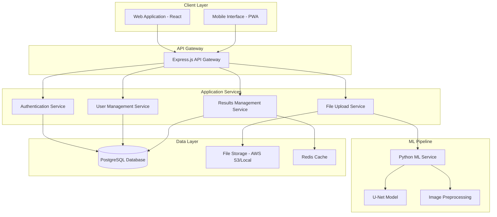

# Leaf Disease Detection System Design Document

## Overview

The Leaf Disease Detection System is a full-stack web application that leverages a U-Net convolutional neural network to identify plant diseases from uploaded leaf images. The system provides real-time analysis, user management, historical tracking, and mobile-optimized interfaces for agricultural professionals, farmers, and researchers.

The architecture follows a microservices approach with a React frontend, Node.js/Express backend, Python-based ML service, and PostgreSQL database, designed for scalability and maintainability.

## Architecture

### High-Level Architecture



### Technology Stack

**Frontend:**
- React 18 with TypeScript for type safety
- Material-UI for consistent design system
- React Query for server state management
- Progressive Web App (PWA) capabilities for mobile

**Backend:**
- Node.js with Express.js for API services
- JWT for authentication
- Multer for file upload handling
- Socket.io for real-time processing updates

**ML Service:**
- Python 3.9+ with FastAPI
- TensorFlow/Keras for U-Net model
- OpenCV for image preprocessing
- NumPy for numerical operations

**Database & Storage:**
- PostgreSQL for relational data
- Redis for caching and session management
- AWS S3 or local storage for image files

## Components and Interfaces

### Frontend Components

**Core Components:**
- `ImageUploadComponent`: Handles file selection, drag-drop, and camera capture
- `ResultsDisplayComponent`: Shows disease detection results with visual overlays
- `HistoryDashboard`: Displays user's previous analyses with filtering
- `UserAuthComponent`: Manages login, registration, and profile
- `AdminDashboard`: System monitoring and analytics for administrators

**Key Interfaces:**
```typescript
interface DetectionResult {
  id: string;
  imageUrl: string;
  diseases: Disease[];
  confidence: number;
  processedAt: Date;
  location?: GeoLocation;
}

interface Disease {
  name: string;
  confidence: number;
  affectedRegions: BoundingBox[];
  treatmentRecommendations: string[];
}
```

### Backend Services

**Authentication Service:**
- JWT token generation and validation
- User registration and login
- Password reset functionality
- Role-based access control

**File Upload Service:**
- Image validation (format, size, content)
- Secure file storage with unique identifiers
- Image compression and optimization
- Metadata extraction

**ML Integration Service:**
- Queue management for processing requests
- Communication with Python ML service
- Result caching and retrieval
- Error handling and retry logic

### ML Service Components

**Image Preprocessing Pipeline:**
- Image normalization and resizing
- Noise reduction and enhancement
- Data augmentation for robustness
- Format standardization

**U-Net Model Interface:**
- Model loading and initialization
- Batch processing capabilities
- Confidence score calculation
- Result post-processing

## Data Models

### Database Schema

**Users Table:**
```sql
CREATE TABLE users (
  id UUID PRIMARY KEY DEFAULT gen_random_uuid(),
  email VARCHAR(255) UNIQUE NOT NULL,
  password_hash VARCHAR(255) NOT NULL,
  first_name VARCHAR(100),
  last_name VARCHAR(100),
  role VARCHAR(50) DEFAULT 'user',
  created_at TIMESTAMP DEFAULT CURRENT_TIMESTAMP,
  updated_at TIMESTAMP DEFAULT CURRENT_TIMESTAMP
);
```

**Detections Table:**
```sql
CREATE TABLE detections (
  id UUID PRIMARY KEY DEFAULT gen_random_uuid(),
  user_id UUID REFERENCES users(id),
  image_url VARCHAR(500) NOT NULL,
  original_filename VARCHAR(255),
  processing_status VARCHAR(50) DEFAULT 'pending',
  confidence_score DECIMAL(5,4),
  location_lat DECIMAL(10,8),
  location_lng DECIMAL(11,8),
  created_at TIMESTAMP DEFAULT CURRENT_TIMESTAMP,
  processed_at TIMESTAMP
);
```

**Diseases Table:**
```sql
CREATE TABLE diseases (
  id UUID PRIMARY KEY DEFAULT gen_random_uuid(),
  detection_id UUID REFERENCES detections(id),
  disease_name VARCHAR(100) NOT NULL,
  confidence DECIMAL(5,4) NOT NULL,
  affected_regions JSONB,
  treatment_recommendations TEXT[]
);
```

### File Storage Structure

```
/uploads/
  /{user_id}/
    /original/
      /{detection_id}.{ext}
    /processed/
      /{detection_id}_result.{ext}
    /thumbnails/
      /{detection_id}_thumb.jpg
```

## Correctness Properties

*A property is a characteristic or behavior that should hold true across all valid executions of a system-essentially, a formal statement about what the system should do. Properties serve as the bridge between human-readable specifications and machine-verifiable correctness guarantees.*

Before defining the correctness properties, let me analyze the acceptance criteria for testability:

<function_calls>
<invoke name="prework">
<parameter name="featureName">leaf-disease-detection

### Property Reflection

After reviewing all testable properties from the prework analysis, I've identified several areas where properties can be consolidated to eliminate redundancy:

**Consolidation Areas:**
- Properties 1.3 and 2.1 both test result structure with confidence scores - can be combined
- Properties 3.1 and 3.5 both address data security - can be unified
- Properties 6.2, 6.3, and 6.4 all relate to model training data management - can be consolidated
- Properties 4.1 and 4.3 both address logging behavior - can be combined

**Final Consolidated Properties:**

Property 1: File validation rejects invalid inputs
*For any* uploaded file, if the file format is not supported or exceeds size limits, the validation should reject it and return appropriate error messages
**Validates: Requirements 1.1, 1.4**

Property 2: Detection results contain required structure
*For any* completed image analysis, the result should contain disease identifications with confidence percentages and visual highlighting data when diseases are present
**Validates: Requirements 1.3, 2.1, 2.2**

Property 3: Batch processing maintains independence
*For any* set of images processed simultaneously, each image should produce the same result as if processed individually
**Validates: Requirements 1.5**

Property 4: Treatment recommendations accompany disease detection
*For any* disease identification result, the system should provide corresponding treatment recommendations
**Validates: Requirements 2.3**

Property 5: Healthy status for low confidence results
*For any* analysis where no disease confidence exceeds the detection threshold, the system should return a healthy leaf status
**Validates: Requirements 2.4**

Property 6: Low confidence flagging
*For any* detection result with confidence below 70%, the system should flag it as requiring expert verification
**Validates: Requirements 2.5**

Property 7: Secure user data storage
*For any* user account creation or data storage operation, sensitive information should be encrypted and personal data should be stored securely
**Validates: Requirements 3.1, 3.5**

Property 8: User history retrieval accuracy
*For any* user login, the system should return only that user's historical detection data with correct timestamps
**Validates: Requirements 3.2**

Property 9: Historical data filtering
*For any* filter criteria applied to historical results, the returned data should contain only records matching all specified criteria
**Validates: Requirements 3.3**

Property 10: PDF export completeness
*For any* export operation, the generated PDF should contain all detection data from the specified time period in a readable format
**Validates: Requirements 3.4**

Property 11: Comprehensive system logging
*For any* image processing operation or error condition, the system should generate detailed log entries with timestamps, processing metrics, and error details
**Validates: Requirements 4.1, 4.3**

Property 12: Analytics data generation
*For any* user activity or system operation, corresponding analytics data should be generated and stored for reporting purposes
**Validates: Requirements 4.4**

Property 13: Model update compatibility
*For any* model version update, the new version should successfully process data formats from previous versions without breaking existing functionality
**Validates: Requirements 4.5**

Property 14: Mobile interface responsiveness
*For any* screen size or touch interaction on mobile devices, the interface should adapt appropriately and maintain full functionality
**Validates: Requirements 5.1**

Property 15: Offline data accessibility
*For any* previously loaded detection results, the data should remain accessible when network connectivity is unavailable
**Validates: Requirements 5.3**

Property 16: GPS data integration
*For any* detection performed with GPS enabled, location coordinates should be accurately captured and stored with the result
**Validates: Requirements 5.4**

Property 17: Image compression quality preservation
*For any* image compressed for mobile upload, the compressed version should produce detection results equivalent to the original image
**Validates: Requirements 5.5**

Property 18: Research data management
*For any* user feedback, expert verification, or new disease submission, the data should be properly collected, validated, and prepared for model training while maintaining user anonymity
**Validates: Requirements 6.1, 6.2, 6.3, 6.5**

## Error Handling

### Client-Side Error Handling

**File Upload Errors:**
- Invalid file formats: Clear messaging with supported format list
- File size exceeded: Progress indication with size limits
- Network failures: Retry mechanism with exponential backoff
- Camera access denied: Fallback to file selection

**Processing Errors:**
- Model service unavailable: Queue request with user notification
- Processing timeout: Clear status updates and retry options
- Invalid image content: Guidance for better image capture

### Server-Side Error Handling

**API Error Responses:**
```typescript
interface ErrorResponse {
  error: {
    code: string;
    message: string;
    details?: any;
    timestamp: Date;
  };
}
```

**Database Error Handling:**
- Connection failures: Automatic retry with circuit breaker
- Constraint violations: Meaningful user feedback
- Transaction rollbacks: Data consistency maintenance

**ML Service Error Handling:**
- Model loading failures: Graceful degradation
- Memory limitations: Request queuing and batching
- Invalid predictions: Confidence threshold enforcement

## Testing Strategy

### Dual Testing Approach

The system will employ both unit testing and property-based testing to ensure comprehensive coverage:

**Unit Tests:**
- Verify specific examples and edge cases
- Test integration points between components
- Validate error conditions and boundary cases
- Cover critical user workflows

**Property-Based Tests:**
- Verify universal properties across all inputs
- Test system behavior with generated data
- Validate correctness properties from the design document
- Use **fast-check** library for JavaScript/TypeScript components
- Use **Hypothesis** library for Python ML service components
- Configure each property test to run minimum 100 iterations
- Tag each property test with format: '**Feature: leaf-disease-detection, Property {number}: {property_text}**'

**Testing Framework Configuration:**
- **Frontend**: Jest + React Testing Library + fast-check
- **Backend**: Jest + Supertest + fast-check  
- **ML Service**: pytest + Hypothesis
- **Integration**: Cypress for end-to-end testing
- **Performance**: Artillery for load testing

**Property Test Requirements:**
- Each correctness property must be implemented by a single property-based test
- Tests must explicitly reference the design document property they implement
- Minimum 100 iterations per property test to ensure statistical confidence
- Smart generators that constrain inputs to valid domains

### Test Data Management

**Image Test Data:**
- Curated dataset of leaf images with known diseases
- Synthetic test images for edge cases
- Invalid file formats for error testing
- Various image sizes and qualities

**User Test Data:**
- Generated user profiles with different roles
- Historical detection data for filtering tests
- Authentication scenarios and edge cases

### Continuous Integration

**Automated Testing Pipeline:**
- Unit tests run on every commit
- Property tests run on pull requests
- Integration tests run on staging deployment
- Performance tests run weekly
- Security scans run on dependencies

**Quality Gates:**
- 90% code coverage requirement
- All property tests must pass
- No critical security vulnerabilities
- Performance benchmarks must be met